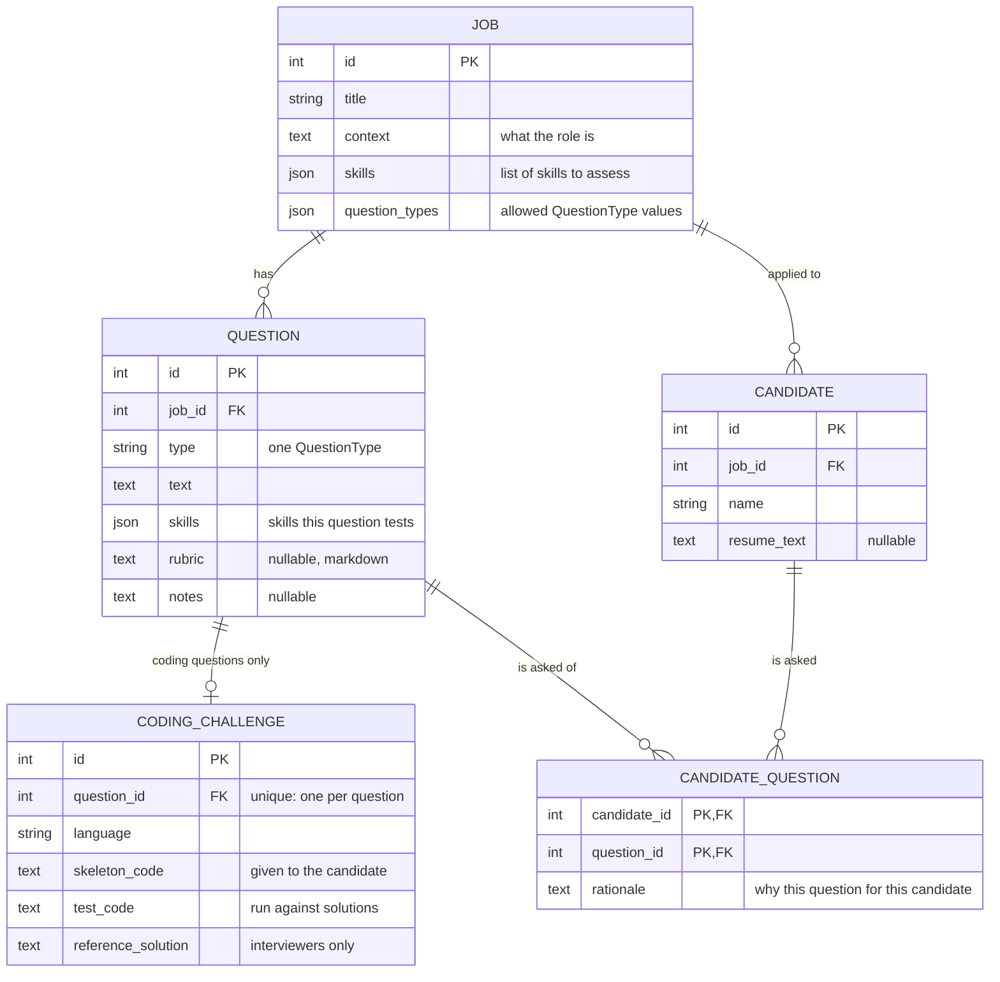

# Calibrate API (FastAPI backend)

Stores jobs, the interview questions written for them, coding challenges, candidates, and the
questions targeted at each candidate. FastAPI + SQLAlchemy 2 + Pydantic 2, on SQLite by default.

## Quick start

Requires Python 3.11+. Run everything from `app/back_end/`.

```sh
python3 -m venv .venv && source .venv/bin/activate    # or: uv venv && source .venv/bin/activate
pip install -r requirements.txt                       # or: uv pip install -r requirements.txt
python -m app.seed                                    # optional demo data (--reset wipes and reloads)
fastapi dev app/main.py                               # http://localhost:8000, auto-reloads on save
pytest                                                # run the tests
```

Interactive docs, where you can try every endpoint, are at **http://localhost:8000/docs**.
If port 8000 is taken, use `fastapi dev app/main.py --port 8001` and point the frontend's
`VITE_API_BASE_URL` at that port.

Config (all optional) goes in `.env`. See `.env.example` for the database URL and CORS origins.

## Data model



Every table also has `created_at` / `updated_at` (UTC).

**Question types** are a fixed set (`QuestionType` in `app/models.py`): `behavioral`, `situational`,
`technical`, `system_design`, `coding`. `GET /question-types` returns them with descriptions.

### Rules the API enforces

| Rule | Error if broken |
| --- | --- |
| A question's `type` must be one of its job's `question_types` | 400 |
| A job can't drop a question type that its questions still use | 409 |
| Only `coding` questions can have a coding challenge | 400 |
| A question has at most one coding challenge | 409 |
| A question with a coding challenge can't change its type | 409 |
| A candidate can only be assigned questions from their own job | 400 |
| A question is assigned to a given candidate at most once | 409 |
| Deleting a job deletes its questions, challenges, candidates, and assignments | – |
| Deleting a question or candidate deletes their assignments (not the other side) | – |

`job_id` can't be changed on a question or candidate after creation, so the cross-job rule above can't
be broken later. Delete the record and create it again instead.

## Endpoints

Lists are returned oldest first. Create and list endpoints sit under the parent resource; get,
update, and delete use the item's own id.

| Method | Path | Notes |
| --- | --- | --- |
| GET | `/question-types` | The fixed type list |
| GET, POST | `/jobs` | |
| GET, PATCH, DELETE | `/jobs/{job_id}` | |
| GET, POST | `/jobs/{job_id}/questions` | `GET ?type=coding` filters by type |
| GET, PATCH, DELETE | `/questions/{question_id}` | |
| GET, POST, PATCH, DELETE | `/questions/{question_id}/coding-challenge` | One per question, so no id of its own in the URL |
| GET, POST | `/jobs/{job_id}/candidates` | |
| GET | `/candidates` | All candidates across jobs |
| GET, PATCH, DELETE | `/candidates/{candidate_id}` | |
| GET, POST | `/candidates/{candidate_id}/questions` | POST `{question_id, rationale?}`. GET embeds each full question |
| PATCH, DELETE | `/candidates/{candidate_id}/questions/{question_id}` | DELETE unassigns. The question itself stays |

PATCH changes only the fields you send. Sending `null` clears an optional field (`rubric`, `notes`,
`resume_text`, `rationale`) and is rejected (422) for a required field. Errors come back as
`{"detail": "..."}`.

**Writing a follow-up question for one candidate** takes two calls: `POST /jobs/{job_id}/questions`
to create it, then `POST /candidates/{candidate_id}/questions` with its id and a rationale.

## Layout

```
app/
  main.py         app setup: CORS, table creation, routers
  config.py       settings from env / .env
  database.py     engine, sessions, SQLite foreign-key enforcement
  models.py       tables and the QuestionType / ProgrammingLanguage enums
  schemas.py      request/response bodies (Create / Update / Read per table)
  deps.py         shared helpers: DbSession, get_or_404, save
  routers/        one file per table
  seed.py         demo data
tests/            one file per area; each test gets a fresh in-memory database
```

## Design notes

- **SQLite by default.** No server to install, so everyone can run it immediately. All database
  access goes through SQLAlchemy, so moving to Postgres is a `DATABASE_URL` change.
- **Foreign keys are switched on for SQLite** (`database.py`). SQLite ignores them by default, which
  would silently leave orphaned rows on delete. A test checks this.
- **Skills are JSON lists of strings**, not a separate skills table. That's simpler, and the API trims
  and de-duplicates them. The cost: "which questions test SQL?" can't be answered with a database index.
  Move to a `skills` table plus join tables if that query matters.
- **Question types are an enum stored as plain text**, not a database enum or lookup table. You add a
  type by editing one Python class, with no migration.
- **`create_all` on startup instead of migrations.** It creates missing tables but never alters
  existing ones. After changing a model, run `python -m app.seed --reset` (wipes data). Switch to
  Alembic once real data needs to survive schema changes.
- **Sync endpoints and sessions.** FastAPI runs them in a thread pool. Simpler and less error-prone
  than async SQLAlchemy, and fast enough for this scale.

## Not built yet

- **Running test code.** `test_code` is stored, not executed. Candidate code must run in a sandbox
  (a container, or a service like Judge0 or Piston), never inside this API process. Seed convention:
  the candidate's file is `solution.py` and the tests import from it.
- **Candidate-facing views.** Every endpoint returns `test_code` and `reference_solution`. Add a
  separate response schema with only `skeleton_code` before anything is shown to candidates.
- **Auth, and the rest of the frontend contract.** See `app/front_end/API_CONTRACT.md`.
