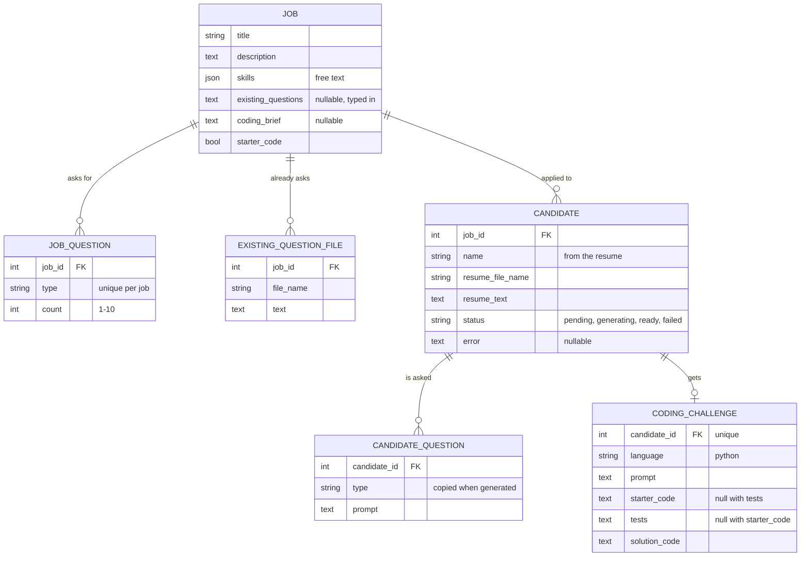

# Calibrate API (FastAPI backend)

Hiring teams describe a job, upload a batch of resumes, and get personalized interview questions
plus a coding challenge for every candidate, generated by Claude. FastAPI + SQLAlchemy 2 +
Pydantic 2, on SQLite by default.

## Quick start

Requires Python 3.11+. Run everything from `app/back_end/`.

```sh
python3 -m venv .venv && source .venv/bin/activate    # or: uv venv && source .venv/bin/activate
pip install -r requirements.txt                       # or: uv pip install -r requirements.txt
cp .env.example .env                                  # then paste the API key into .env
python -m app.seed                                    # optional demo data (no Claude calls)
fastapi dev app/main.py                               # http://localhost:8000, auto-reloads on save
pytest                                                # tests use a fake Claude: free, no key needed
```

Interactive docs, where you can try every endpoint (including uploads), are at
**http://localhost:8000/docs**. If port 8000 is taken, add `--port 8001` and point the frontend's
`VITE_API_BASE_URL` at it.

**After pulling schema changes**, run `python -m app.seed --reset` (or delete `calibrate.db`). Tables
are created on startup but never altered.

## The Claude API key

- It goes in `app/back_end/.env` as `ANTHROPIC_API_KEY=...`. Git ignores that file.
- Never put it in the frontend: anything Vite builds (every `VITE_*` variable) ships to the browser.
- Share it through a password manager, not the repo or a group chat. If it leaks, revoke it in the
  Claude Console. Deleting the commit isn't enough.
- Without a key, everything works except generation and reading scanned PDFs, which fail with a
  message saying the key is missing.

## How generation works

1. A user creates a job: title, description, skills, how many questions of each type, an optional
   coding brief, and whether coding challenges come with starter code.
2. Optionally, they type the questions the team already asks, upload PDFs of them, or both.
   Generated questions avoid repeating them.
3. They upload resume PDFs (any number at once). Each becomes a candidate right away with status
   `pending`, and the request returns.
4. In the background, a few at a time, Claude reads each resume against the job and returns the
   candidate's name, one question per requested slot, and a Python coding challenge. Status becomes
   `ready` or `failed` (with an `error` a recruiter can act on). The UI polls the candidate list.
5. Users can edit any generated question or challenge. A failed candidate can be retried.

Rules that follow from this:

- **Generated material is frozen.** Candidate questions are copies, not links to the job, so
  editing the job, its question counts, or its existing-question files never changes candidates who
  already have questions. A batch uses the job's settings from the moment it was uploaded.
- **No starter code means no tests**, both in what Claude generates and when editing by hand.
- **Questions are ordered by type**, in the order `QuestionType` declares them: debugging,
  behavioral, situational, technical, system design, resume deep dive, code review, data modeling,
  testing strategy, motivation, leadership. The frontend's list in `src/lib/constants.ts` mirrors it.
- **PDFs become plain text.** Text is extracted locally. A scanned PDF with no text layer is
  transcribed by Claude instead (a few seconds, a small cost).
- **A restart interrupts generation.** `fastapi dev` restarts on every file save, and anything
  mid-generation is then marked `failed` with "interrupted". Retry it.

### Cost

Each resume is one Claude call (two for a scanned PDF). Output tokens are most of the cost, and the
job description and instructions are cached across a batch. Rough estimates for a typical resume:

| Model | Per resume | 100 resumes |
| --- | --- | --- |
| Claude Opus 5.5 (default) | ~7¢ | ~$7 |
| Claude Sonnet 5.5 | ~3–4¢ | ~$3.50 |

These are estimates. Every call logs its real token counts and cost, for example
`INFO app.ai: Claude generate: 812 input, 0 cache write, 1150 cache read, 2904 output tokens ~$0.0616`.
Run two or three resumes first and check. To spend less, set `CLAUDE_EFFORT=low` or
`CLAUDE_MODEL=claude-sonnet-5-5` in `.env`.

## Data model



Every table also has `id`, `created_at` and `updated_at` (UTC). Deleting a job deletes everything
under it. Deleting a candidate deletes their questions and challenge.

## Endpoints

| Method | Path | Notes |
| --- | --- | --- |
| GET | `/question-types` | The fixed type list, in display order, with descriptions |
| GET, POST | `/jobs` | Body includes `questions: [{type, count}]` |
| GET, PATCH, DELETE | `/jobs/{job_id}` | PATCH `questions` replaces the whole list |
| GET, POST | `/jobs/{job_id}/existing-questions` | POST: multipart `files` (PDFs) |
| DELETE | `/jobs/{job_id}/existing-questions/{file_id}` | |
| POST | `/jobs/{job_id}/candidates` | Multipart `files` (resume PDFs). Returns 202 and generates in the background |
| GET | `/jobs/{job_id}/candidates` | Poll this for status |
| GET | `/candidates` | All candidates across jobs |
| GET, PATCH, DELETE | `/candidates/{candidate_id}` | GET includes resume text, questions and challenge. PATCH edits `name` |
| POST | `/candidates/{candidate_id}/retry` | Failed candidates only. Uses the job's current settings |
| PATCH | `/candidate-questions/{question_id}` | Edit a question's `prompt` |
| PATCH | `/candidates/{candidate_id}/coding-challenge` | Edit any challenge field |

PATCH changes only the fields you send. Sending `null` clears an optional field and is rejected
(422) for a required one. Uploads are PDFs only, up to 10 MB each. One bad file rejects the whole
upload before anything is created or paid for. Errors come back as `{"detail": "..."}`.

## Layout

```
app/
  main.py         app setup: logging, CORS, startup, routers
  config.py       settings from env / .env
  database.py     engine, sessions, SQLite foreign-key enforcement
  models.py       tables, and the QuestionType / ProgrammingLanguage / CandidateStatus enums
  schemas.py      request/response bodies
  ai.py           everything that calls Claude: the prompt, output schema, cost logging
  pdf_text.py     PDF to text
  generation.py   the background worker that fills in candidates
  deps.py         shared helpers: DbSession, get_or_404, save, upload checks
  routers/        jobs, question types, existing questions, candidates
  seed.py         demo data
tests/            each test gets a fresh in-memory database and a fake Claude
```

## Design notes

- **One Claude call per resume, with a schema built per job.** Structured outputs guarantee valid
  JSON but can't enforce list lengths, so each question gets its own required key (`behavioral_1`,
  `behavioral_2`, ...). That guarantees exactly the requested number of each type.
- **The prompt is split for caching.** Instructions and job details come first and are cached.
  Only the resume changes between calls in a batch.
- **Refusal fallback is on.** If a safety classifier declines a request, the API retries it on the
  model Anthropic recommends for that case. On Opus 5.5 that's typically Opus 5 or Opus 4.8, which
  cost a little more ($5 / $25 per million tokens), but only on the rare declined request.
- **Background work runs in-process** (FastAPI background tasks plus a small thread pool). That's
  simple, and fine for a demo. A restart loses queued work, which is why startup marks it failed.
- **SQLite by default**, with foreign keys switched on (SQLite ignores them otherwise). Moving to
  Postgres is a `DATABASE_URL` change.

The frontend calls these endpoints through `app/front_end/src/lib/api.ts`. The shared contract is
`app/front_end/API_CONTRACT.md`.

## Not built yet

- **Server sign-in.** Sign-in is local to the frontend for the hackathon.
- **Regenerating a candidate who already has questions.** Only failed candidates can be retried.
- **Other languages for coding challenges.** `ProgrammingLanguage` has only Python.
- **Uploading the candidate's finished work, and the AI analysis of it.**
